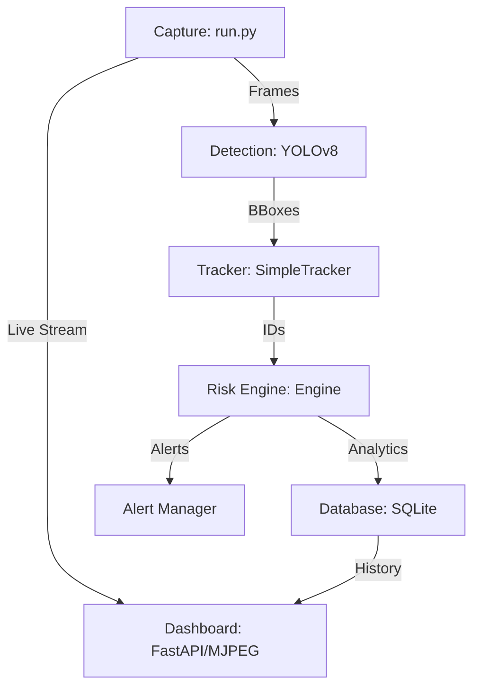

# Project Status: Nerisal Kaval (CrowdCare)

Nerisal Kaval is now a high-performance, multi-camera crowd monitoring system with advanced spatial analytics and a premium dashboard.

## 🏗 System Architecture

## 🌟 Recent Enhancements

### 1. High-Frequency Sampling
The system now operates at **1Hz** (sampling 1 frame per second), providing much smoother monitoring compared to the previous 5-second interval.

### 2. Multi-Source Pipeline
The pipeline is now optimized for different environments:
- **CLI Arg**: Use `python run.py --source <ID/Path>` to switch between webcams or demo files.
- **Headless Support**: Added safety wrappers for `cv2.imshow` so the system can run on servers without crashing.

### 3. Advanced Risk Intelligence
Beyond simple counting, the system now performs:
- **Density Classification**: Categorizes zones (Empty, Sparse, Medium, Dense).
- **Hotspot Detection**: Identifies local congestion points (clusters) using heatmap analysis.
- **Dual Alerts**: 
    - ⚠️ **Amber**: Warning for elevated risk.
    - 🚨 **Red**: Critical danger requiring immediate intervention.

### 4. Premium Dashboard
The web interface located at `http://localhost:8000/` has been upgraded with:
- **Intelligence Cards**: Real-time display of Count, Density, Class, and exact **Hotspot coordinates**.
- **Cluster Highlighting**: Cards flash and display warning icons when a dangerous cluster is detected.
- **Theme Support**: Dark/Light mode switching with glassmorphic aesthetics.

## 📊 Current Files & Components

| Component | Responsibility | Status |
|-----------|----------------|--------|
| `run.py` | Main event loop, detection, tracking | Active |
| `app/config.py` | Global settings (Intervals, Thresholds) | Updated |
| `app/main.py` | FastAPI server & MJPEG streaming logic | Stable |
| `app/alerts/alert_manager.py` | Severity-based notification logic | Enhanced |
| `dashboard/script.js` | Real-time UI rendering & state management | Enhanced |
| `metrics.db` | SQLite database for historical reporting | Active |

## 🚀 How to Run

1.  **API**: `uvicorn app.main:app --reload`
2.  **Pipeline**: `python run.py --source 0`
3.  **Visuals**: Open [http://localhost:8000](http://localhost:8000)

---
*Status: Ready for Production-quality testing.*
